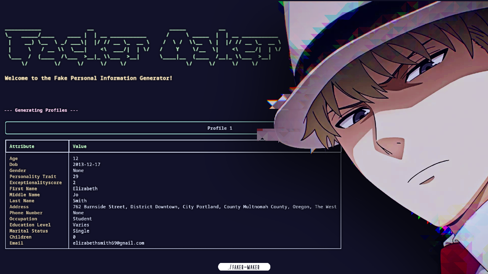

# Faker-Maker

Hi, this is my weird little project: **Faker-Maker**. It makes fake people.  
Not real people — just profiles. For testing, for playing, for whatever.

> To be honest: I didn’t write the code myself. I used AI to generate all of it.  
> I just designed how it should work, told AI what to build, and slowly glued the parts together.

---

## 🧠 How it thinks (sort of)

Faker-Maker tries to do something a bit different:  
Almost **everything in a profile comes from a small set of core traits** — like region, age, and basic personality.

From that internal core, the system builds outward logically.

**Example**:  
If someone is 18, lives in Vietnam, and has a cheerful personality →  
their job might be "university student", their hobbies are age-appropriate, their behavior looks youthful, and their name sounds local.

The goal is to simulate something like **"inner → outer" logic**, not just pull random values from a list.

It’s not perfect — but sometimes the profiles feel strangely real.

---

## ✨ Why is this not completely useless?

- **It checks logic**  
  A 6-year-old will not be a dentist. Unless you force it.

- **Culturally consistent**  
  Vietnamese profiles sound Vietnamese. Chinese profiles sound Chinese. Sort of.

- **Easily expandable**  
  You can add new jobs, names, countries with simple JSON files. No code editing needed.

---

## 🌏 About the data

At the moment, **Vietnamese data is the most complete and coherent**.  
That includes:
- Names (male/female/neutral)
- Region-specific occupations
- Local education levels
- Hobbies that match Vietnamese age groups

Other countries (US, UK, China) are included, but still pretty shallow for now.

---

## ✅ What works

- Generate profiles with:
  - Name, age, gender
  - Region (Vietnam, US, UK, China)
  - Occupation, education
  - Marital status, hobbies, skills
  - Optional: personality traits, life events, online behavior
- Run with:
  - Interactive terminal menu
  - Command-line flags
- Save to JSON or CSV
- Simple login system
- Logic validation engine

---

## ⚠️ What doesn't (yet)

| Feature | Status |
|--------|--------|
| TUI interface | 🚧 Not finished |
| Profile presets | ❌ Missing |
| Deep logic modeling | 💤 Basic only |
| High-volume generation | ❓ Untested |
| Fancy UI | ❌ Never going to happen |

---

## 💻 Installation

You’ll need Python 3.6+.

```bash
git clone https://github.com/your-username/faker-maker.git
cd faker-maker
pip install -r requirements.txt
```

---

## 🚀 Usage

### Option 1: Menu mode

The easiest way. Just run:

```bash
python main.py
```

You’ll get a menu like:
- Generate profiles
- See project info
- Exit

### Option 2: Command-line mode

Generate profiles directly:

```bash
python main.py --num-profiles 3 --region VN_GENERAL --include-unconventional
```

Run `python main.py --help` to see all available flags.

---

## 🗂 Project structure

| Folder | What’s inside |
|--------|----------------|
| `profile_generator/` | Core logic for profile generation |
| `data/` | Names, jobs, regions (JSON) |
| `auth/` | Login system (experimental) |
| `user_input/` | Handle command-line and menu inputs |
| `utils/` | Helper functions and logic checks |
| `generated_profiles/` | Where generated profiles are saved |
| `assets/` | Logo and thumbnails |
| `tests/` | Basic test scripts |

---

## 🔮 Roadmap (if I stay motivated)

- Finish the TUI interface
- Expand Vietnam data even more
- Add better logic inference and presets
- Add behavior simulation: how fake people spend time online
- Maybe try exporting to other formats like XML or SQLite

---

## 🧼 License

MIT.  
Free to use, remix, fork. Just don’t use it to scam people or do shady stuff. (it can't, right ?)

---

## 🙃 Final thoughts

This is not a startup.  
This is not production-ready software.  
This is just me experimenting with ideas and letting AI do the typing.

But if one fake profile makes you go  
> "wait, this kinda feels real..."  
then I’ve done my job.
